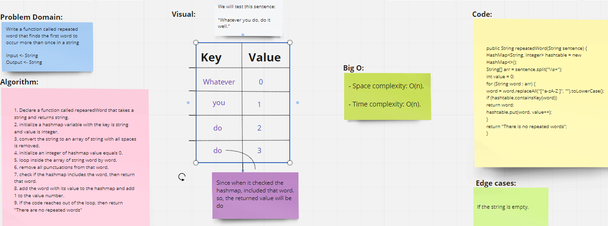
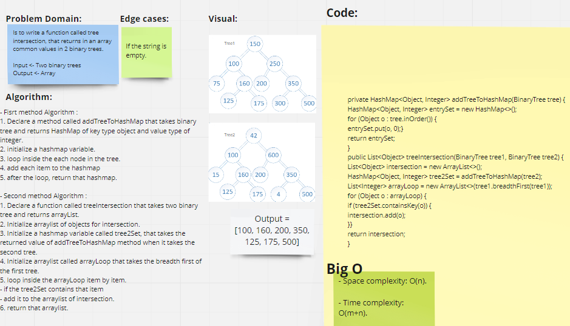
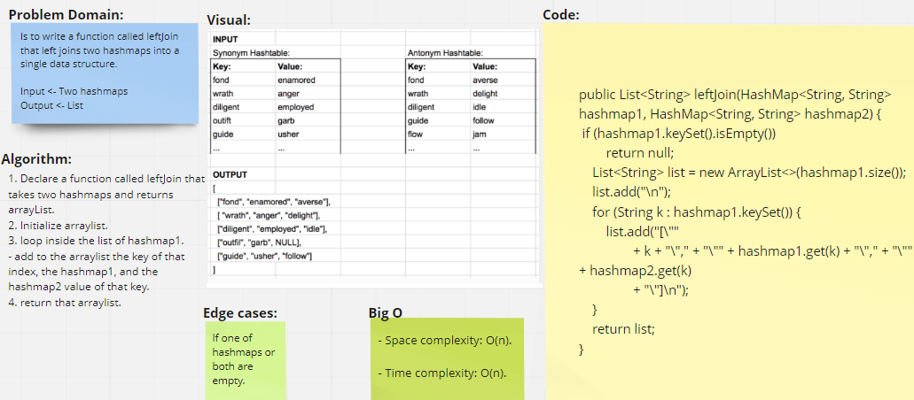

# HashTable

## Code Challenge 30:
A hash table is a data structure that implements a hash table array, which maps keys to values. 

## Challenge
- **We asked to implement hashtable by Creating 2 classes with their basic methods:**
1. **Node class**
2. **HashTable Class**

## Approach & Efficiency
- **Space complexity** -> O(n).

- **Time complexity** ->
1. **hashCode** mehod -> O(1)
2. **getBucketIndex** mehod -> O(n)
3. **isEmpty** method -> O(1)
4. **add** method -> O(n)
5. **remove** method -> O(n)
6. **get** method (for search) -> O(n)

Because it could include more than one item point to the single cell

## API
### HashTable Class Methods:
1.  **hashCode(K key)** ->  hashes the key using built in java hash function
returns hashCode of the key
2.  **getBucketIndex(K key)** -> Gets the index of where the value is located in the bucket array.
returns bucketIndex.
3. **isEmpty()** -> checks if hashTable is empty
returns boolean.
4. **add(K key, V value)** -> adds the key/value pairs to the table.
5. **remove(K key)** -> remove the value from the table
returns deleted value.
6. **get(K key)** -> return the value from the table based on inserted key.

    
----

## Hashmap Repeated Word:

## Challenge Summary

Write a function called repeated word that finds the first word to occur more than once in a string.

## Whiteboard Process

## Approach & Efficiency

lopp:

Time Approach : O(N)

Space : O(N)

----

# Tree Intersection

## Challenge Summary

Find all values found to be in 2 binary trees

- Write a function called tree intersection
- Arguments: two binary trees
- Return: array

## Whiteboard Process

## Approach & Efficiency

**Time Approach** : O(2N) - for loop 2 separate times.

**Space Approach** : O(N) - create hash map and arrayList.

----

#  Implement a simplified LEFT JOIN for 2 Hashmaps.

## Challenge Summary
<!-- Description of the challenge -->
Write a function called **leftJoin** that left joins two hashmaps into a single data structure.

**Arguments:** Two hash maps
**Return:** List 

## Whiteboard Process
<!-- Embedded whiteboard image -->

  
## Approach & Efficiency

<!-- What approach did you take? Why? What is the Big O space/time for this approach? -->
### - Approach:
#### **Fisrt method Algorithm :**

1. Declare a function called leftJoin that takes two hashmaps and returns arrayList.
2. Initialize arraylist.
3. loop inside the list of hashmap1.
- add to the arraylist the key of that index, the hashmap1, and the hashmap2 value of that key.
4. return that arraylist.

  
### - Efficiency:
- **Space complexity** -> O(n)

- **Time complexity** -> O(n), where n is number of hashmap1 keys.

  
## Solution
<!-- Show how to run your code, and examples of it in action -->
- Initialize A variable from **LeftJoin Class**.
- then call the **leftjoin(hashmap1, hashmap2)** method.

---