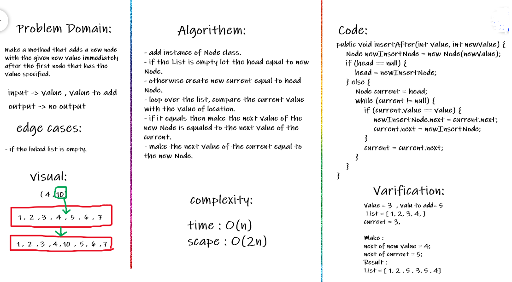
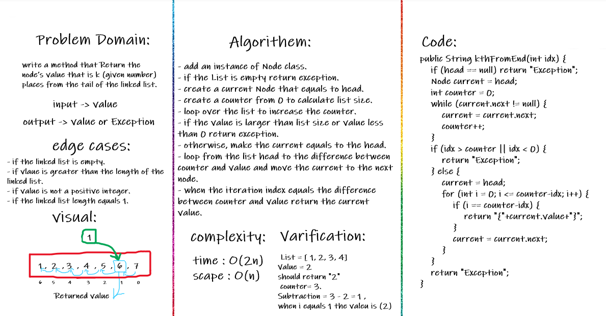

# Singly Linked List

<!-- Short summary or background information -->

Singly linked lists are the simplest type of linked list, Refers to the number of references the node has. A Singly linked list means that there is only one reference.

## Challenge

<!-- Description of the challenge -->

Create a Node class to Create a Linked List and write a methods to add the linked list, check of a value is in that list and print the list content as a String.
throw a custom, semantic error that describes what went wrong in calling the methods. and make a test for every possible cases of linked list.

## Approach & Efficiency

<!-- What approach did you take? Why? What is the Big O space/time for this approach? -->

approach I took: `while()` loop. This allows me to continually check that the Next node in the list is not null.

Time : O(n).
Space : O(1).

## API

<!-- Description of each method publicly available to your Linked List -->

**insert()**

Adds a new node with value from Arguments to the head of the list with an O(1) Time performance.

**includes()**

Method that accept a value and Indicates whether that value exists as a Node’s value somewhere within the list and Returns a true otherwise return false.

**toString()**

Returns: a string representing all the values in the Linked List, formatted as:
`"{ a } -> { b } -> { c } -> NULL"`

 

## Challenge Add Node At Last :

**append(int)**: adds a new node with the given value to the end of the list.

## Whiteboard Process

## Approach & Efficiency

loop,
time : O(n)
scape : O(2n)

## Challenge Add Node Before specific node:

**insertBefore(int, int)**
method to add a new node with the given new value immediately before the first node that has the value specified.

## Whiteboard Process

## Approach & Efficiency

loop,
time : O(n)
scape : O(2n)

## Challenge Add Node After specific node:

**insertAfter(int , int)**
method to add a new node with the given new value immediately after the first node that has the value specified

## Whiteboard Process

## Approach & Efficiency

loop,
time : O(n)
scape : O(2n)

## Challenge kth from end:

**kthFromEnd(int)**
write a method that Return the node’s value that is k (given number) places from the tail of the linked list.

## Whiteboard Process

## Approach & Efficiency

loop,
time : O(2n)
scape : O(n)