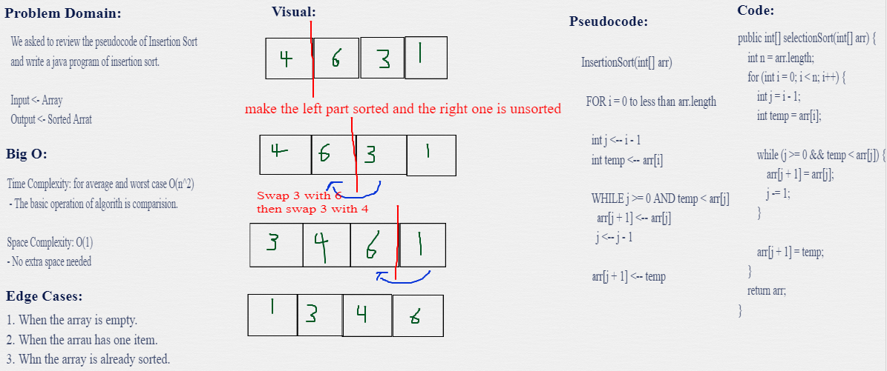

# Sorting Algorithms

- In computer science, a sorting algorithm is an algorithm that puts elements of a list into an order. 

---

## Insertion(Selection) Sort
Selection Sort is a sorting algorithm that traverses the array multiple times finding the ascending/descending order.

## Challenge Summary
<!-- Description of the challenge -->
 sorting an Array of elements from the beginning to end. 

## Pseudocode
```
  InsertionSort(int[] arr)

    FOR i = 1 to arr.length

      int j <-- i - 1
      int temp <-- arr[i]

      WHILE j >= 0 AND temp < arr[j]
        arr[j + 1] <-- arr[j]
        j <-- j - 1

      arr[j + 1] <-- temp
```

## Example steps
[8,4,23,42,16,15]

- We divide our array to 2 parts which is left and right.
### (1)
- The first step involves the first element.
[8|,4,23,42,16,15]

### (2)
- The second step involves the first 2 elements.  
[4,8|,23,42,16,15]
- so we ended up with the first two elements sorted.

### (3)
[4,8|,23,42,16,15]
[4,8,23|,42,16,15]
[4,8,23,42|,16,15]
[4,8,23,42,16|,15]
[4,8,23,16,42|,15]
[4,8,16,23,42|,15]
[4,8,16,23,15,42|]
[4,8,16,15,23,42|]
[4,8,15,16,23,42|]

And this is our final sorted array.

## Whiteboard Process
<!-- Embedded whiteboard image -->


## Approach & Efficiency
<!-- What approach did you take? Why? What is the Big O space/time for this approach? -->
- **Time Complexity:** for average and worst case O(n^2) - The basic operation of algorith is comparision.

- **Space Complexity:** O(1) - No extra space needed

## Solution
<!-- Show how to run your code, and examples of it in action -->
You just need to call selectionSort method and insert your array.

---
