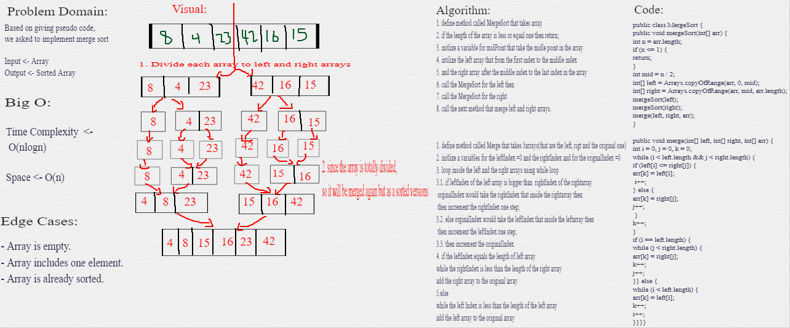

# Sorting Algorithms

- In computer science, a sorting algorithm is an algorithm that puts elements of a list into an order. 

---
## Merge Sort
Is a Divide and Conquer algorithm
It divides the input array into two halves, and then merges the two sorted halves.

## Challenge Summary
<!-- Description of the challenge -->
Sorting an Array of elements from the beginning to end using merge sort. 

## Pseudocode
```
 ALGORITHM Mergesort(arr)
    DECLARE n <-- arr.length

    if n > 1
      DECLARE mid <-- n/2
      DECLARE left <-- arr[0...mid]
      DECLARE right <-- arr[mid...n]
      // sort the left side
      Mergesort(left)
      // sort the right side
      Mergesort(right)
      // merge the sorted left and right sides together
      Merge(left, right, arr)

ALGORITHM Merge(left, right, arr)
    DECLARE i <-- 0
    DECLARE j <-- 0
    DECLARE k <-- 0

    while i < left.length && j < right.length
        if left[i] <= right[j]
            arr[k] <-- left[i]
            i <-- i + 1
        else
            arr[k] <-- right[j]
            j <-- j + 1

        k <-- k + 1

    if i = left.length
       set remaining entries in arr to remaining values in right
    else
       set remaining entries in arr to remaining values in left
```


## Whiteboard Process
<!-- Embedded whiteboard image -->


## Approach & Efficiency
<!-- What approach did you take? Why? What is the Big O space/time for this approach? -->
- **Time Complexity:**  O(nlogn)
- **Space Complexity:** O(n)

## Solution
<!-- Show how to run your code, and examples of it in action -->
You just need to call mergeSort method and insert your array.

---