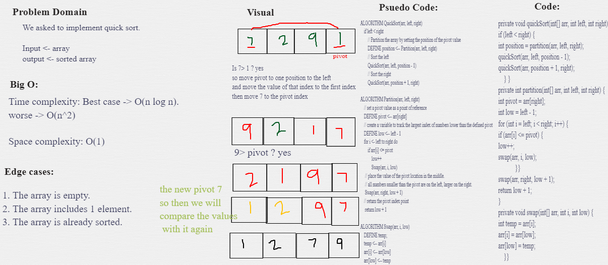

## Quick Sort
QuickSort is a Divide and Conquer algorithm as well.
It picks an element as pivot and partitions the given array around the picked pivot. 

## Challenge Summary
<!-- Description of the challenge -->
 sorting an Array of elements from the beginning to end using quick sort. 

## Pseudocode
```
 ALGORITHM QuickSort(arr, left, right)
    if left < right
        // Partition the array by setting the position of the pivot value
        DEFINE position <-- Partition(arr, left, right)
        // Sort the left
        QuickSort(arr, left, position - 1)
        // Sort the right
        QuickSort(arr, position + 1, right)

ALGORITHM Partition(arr, left, right)
    // set a pivot value as a point of reference
    DEFINE pivot <-- arr[right]
    // create a variable to track the largest index of numbers lower than the defined pivot
    DEFINE low <-- left - 1
    for i <- left to right do
        if arr[i] <= pivot
            low++
            Swap(arr, i, low)

     // place the value of the pivot location in the middle.
     // all numbers smaller than the pivot are on the left, larger on the right.
     Swap(arr, right, low + 1)
    // return the pivot index point
     return low + 1

ALGORITHM Swap(arr, i, low)
    DEFINE temp;
    temp <-- arr[i]
    arr[i] <-- arr[low]
    arr[low] <-- temp
```

## Example steps
[8,4,23,42,16,15]

- We will assign **15** as **pivot**, and we will compare values with the pivot.

### (1)
[8,4,23,42,16,15]
- 15 < 8 ?? No
- 15 < 4 ?? No
- 15 < 23 ?? yes

### (2)
[8,4,15,42,16,23]
and now we will divide it

### (3)
[8,4,15] [42,16,23]
left array is sorted
let's check second array.

### (4)
[42,16,23]
- 16 < 42? yes

### (5)
[16,42,23]
- 23 < 42? yes

### (6)
[16,23,42]
- this array is now sorted, so let's conqure the final output.

### (8)
[4,8,15,16,23,42]


## Whiteboard Process
<!-- Embedded whiteboard image -->


## Approach & Efficiency
<!-- What approach did you take? Why? What is the Big O space/time for this approach? -->
- **Time Complexity:** Best case, O(n log n)  n steps to partition the array, log n times.
worse O(n^2)

- **Space Complexity:** O(1) - Since, it only swaps elements within the array

## Solution
<!-- Show how to run your code, and examples of it in action -->
You just need to call quickSort method and insert your array.
